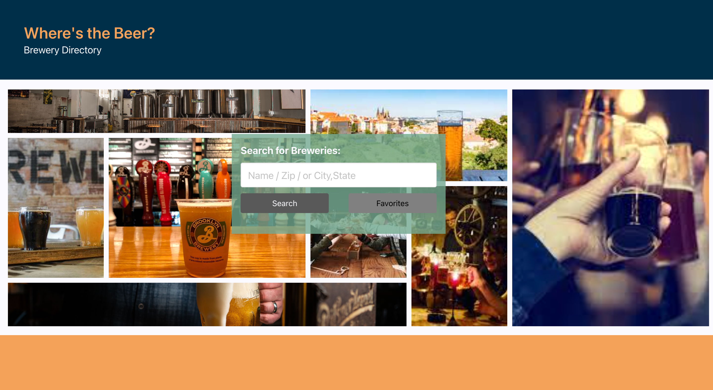
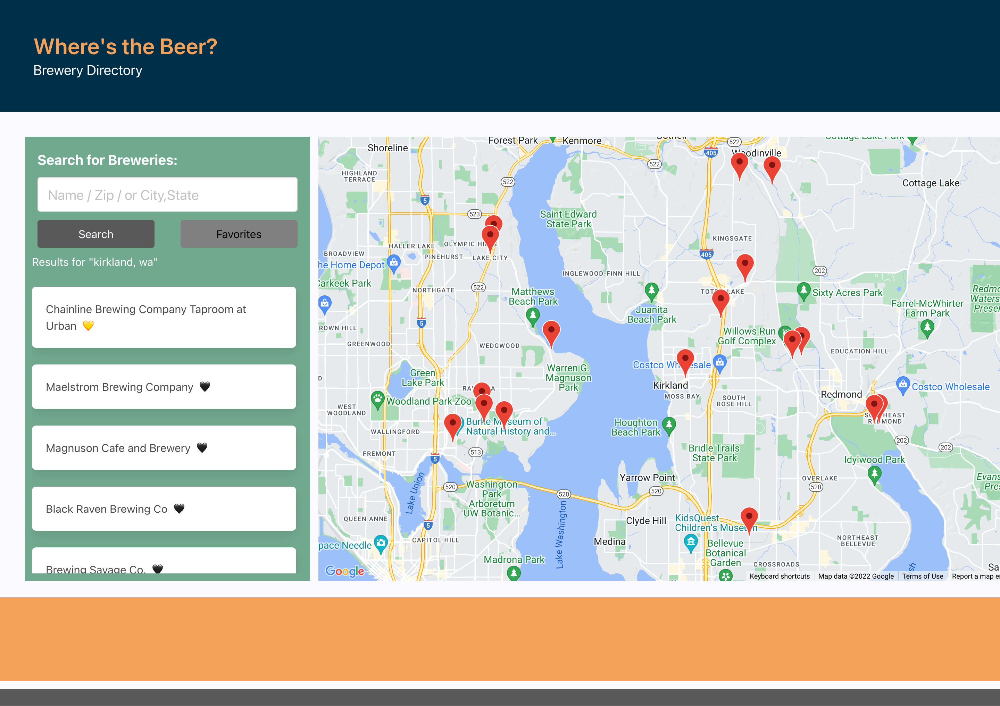

# Project 1: Interactive Front-End Application - (Where's The Beer)

## Description

This app enables users to search for breweries, displays those search results on a map, draws the route to the selected brewery and provide driving directions to the selected brewery. This app runs in the browser and features dynamically updated HTML and CSS powered by Javascript and jQuery.We utilized Moment.js while working with the date and time and local storage for persistence. It also has a clean and polished, responsive user interface that adapts to multiple screen sizes.

## Mock-Up

The following image shows the web application's appearance:

## Link

[Live site](https://github.com/framenolan/wheres-the-beer)

## Roles

- [Chuan Wang](https://github.com/chuanw101) : Lead Developer, Brewery API, favorites functionality, advanced layout and styling
- [Nolan Frame](https://github.com/framenolan) : Git Administrator, lead on layout and styling
- [Brian Bixby](https://github.com/brianbixby) : Project Manager, lead on Google APIs

## Elevator Pitch

Picture this: It’s a beautiful sunny day, you and your friends have decided to check out some breweries in your neighborhood, but you’re not sure which ones you should visit. At this point, you may be asking yourself, “Where’s the beer?”

Well, with our app, we’re gonna help you find it.

By using search parameters of a Zip Code, keyword (ex. brewery name), or a combination of city and state (Seattle, WA), you’ll be presented with a list and map of breweries to choose from.

Once you’ve decided on a destination, you'll be presented with turn-by-turn directions using either your current location or by entering a custom starting point.

You can even curate your own list of favorites that will be waiting for you when you revisit the website.

## Wireframe

[Wireframe link](https://excalidraw.com/#json=EchuAVXgSvE89NOFk6kKE,Fgz1jW-q9WBfOE_FX4la6A)

## Technology

- [HTML](https://developer.mozilla.org/en-US/docs/Web/HTML)
- [CSS](https://developer.mozilla.org/en-US/docs/Web/CSS)
- [Javascript](https://developer.mozilla.org/en-US/docs/Web/javascript)
- [jQuery](https://jquery.com/)
- [Github](https://github.com/framenolan/wheres-the-beer)
- [Local Storage](https://developer.mozilla.org/en-US/docs/Web/API/Window/localStorage)
- [Navigator](https://developer.mozilla.org/en-US/docs/Web/API/Navigator)
- [Fetch](https://developer.mozilla.org/en-US/docs/Web/API/Fetch_API)
- [Moment.js](https://momentjs.com/)
- [Open Brewery API](https://www.openbrewerydb.org/)
- [Google Maps/Places/Geocode APIs](https://console.developers.google.com)
- [Bulma CSS Framework](https://bulma.io/)
